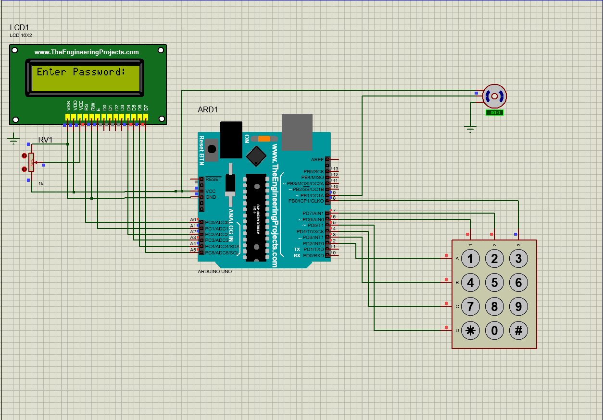

# Arduino Based Password Door Lock System

This is a smart door locking system project created using Arduino Uno, 4x3 Keypad, 16x2 LCD, and a Servo Motor. The project was designed and simulated in Proteus.

## Features
* Secure password-based entry (Default: 1234).
* Real-time LCD feedback.
* Automatic servo motor rotation for locking/unlocking.
* Custom keypad logic without external libraries (for compatibility).
# Arduino Based Password Door Lock System

এটি একটি পাসওয়ার্ড ভিত্তিক স্মার্ট লক সিস্টেম... (এক লাইনের বর্ণনা)

## বৈশিষ্ট্য (Features)
...
## Components Used
* Arduino Uno
* 16x2 LCD Display (I2C/Parallel)
* 4x3 Matrix Keypad
* Servo Motor
* 1k Potentiometer (for LCD contrast)

## Pin Connections
- **LCD:** RS->A0, E->A1, D4->A2, D5->A3, D6->A4, D7->A5
- **Keypad:** Rows->2,3,4,5 | Columns->6,7,8
- **Servo:** Signal->9, Power->5V, Ground->GND

## How to Run
1. Open the `.ino` file in Arduino IDE.
2. Compile and export the `.hex` file.
3. Open the Proteus file (`.pdsprj`).
4. Load the `.hex` file into the Arduino component in Proteus.
5. Run the simulation.
